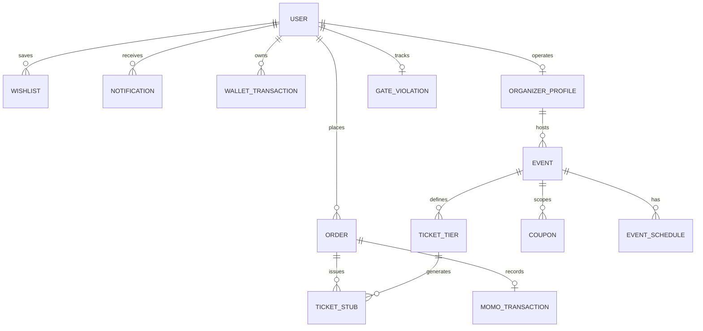

# Eventspady Backend API Specification & Endpoint Documentation

**Version:** 1.0.0  
**Base URL:** `https://api.eventspady.com/v1` (Production) / `http://localhost:5000/api/v1` (Development)  
**Protocol:** HTTPS / RESTful JSON  
**Authentication:** Bearer JWT (`Authorization: Bearer <jwt_token>`)  
**Default Currency:** `GHS` (Ghanaian Cedi — GH₵)  
**Default Timezone:** `Africa/Accra` (GMT)  
**Target Region:** Ghana (Upper West Region focus: Wa, Jirapa, Nandom, Lawra, Tumu, etc.)

> **Note on Required Endpoints:** For a categorized list of all additional endpoints required by the frontend application with schemas and request/response contracts, see [NEEDED_APIS.md](file:///Users/user/Documents/Dev_KINDO/eventspady/docs/NEEDED_APIS.md).

---

## 1. Architectural Overview & Global Standards

### 1.1 HTTP Status Codes
- `200 OK`: Request succeeded.
- `201 Created`: Resource successfully created.
- `204 No Content`: Successful request with no body returned.
- `400 Bad Request`: Malformed request syntax or validation failure.
- `401 Unauthorized`: Missing, expired, or invalid authentication token.
- `403 Forbidden`: Authenticated user lacks sufficient permissions (e.g. unverified organizer, non-admin).
- `404 Not Found`: Resource does not exist.
- `409 Conflict`: Duplicate entry (e.g. email already registered, ticket code collision, already checked-in).
- `422 Unprocessable Entity`: Business logic error (e.g. sold out, expired coupon, gate barred attendee).
- `429 Too Many Requests`: Rate limit exceeded (e.g. MoMo USSD push abuse).
- `500 Internal Server Error`: Server failure.

### 1.2 Standard Response Format
```json
{
  "success": true,
  "data": {},
  "message": "Operation completed successfully",
  "meta": {
    "timestamp": "2026-09-26T18:00:00.000Z",
    "requestId": "req_gh_9823190823"
  }
}
```

### 1.3 Standard Error Format
```json
{
  "success": false,
  "error": {
    "code": "ORGANIZER_NOT_VERIFIED",
    "message": "Your organizer account is pending review. An administrator must verify your credentials before portal access.",
    "details": []
  },
  "meta": {
    "timestamp": "2026-09-26T18:00:00.000Z",
    "requestId": "req_err_8712398"
  }
}
```

---

## 2. Entity-Relationship & Architecture Overview



---

## 3. Comprehensive API Endpoints Directory

### Summary Table

| Category | Method | Endpoint | Access | Purpose |
| :--- | :--- | :--- | :--- | :--- |
| **Auth** | `POST` | `/auth/register` | Public | Register new attendee or organizer |
| | `POST` | `/auth/login` | Public | Log in with email and password |
| | `POST` | `/auth/google` | Public | Sign in / register via Google OAuth |
| | `POST` | `/auth/forgot-password` | Public | Request password reset token via email/SMS |
| | `POST` | `/auth/reset-password` | Public | Complete password reset with token |
| | `POST` | `/auth/refresh-token` | Public | Refresh expired JWT access token |
| | `POST` | `/auth/logout` | Authenticated | Revoke session / blacklist token |
| | `GET` | `/auth/me` | Authenticated | Retrieve current user profile and role |
| **Users** | `PATCH` | `/users/profile` | Authenticated | Update user name, phone, city, avatar |
| | `PATCH` | `/users/password` | Authenticated | Change account password |
| | `GET` | `/users/notifications` | Authenticated | Get notification history with unread count |
| | `PATCH` | `/users/notifications/:id/read` | Authenticated | Mark specific notification as read |
| | `POST` | `/users/notifications/read-all` | Authenticated | Mark all notifications as read |
| | `GET` | `/users/wallet` | Authenticated | Get current wallet balance & ledger |
| | `POST` | `/users/wallet/topup` | Authenticated | Initiate MoMo USSD top-up to wallet |
| | `GET` | `/users/gate-status` | Authenticated | Check Pay-at-Gate violation & barred status |
| **Events** | `GET` | `/events` | Public | List published events with query filters |
| | `GET` | `/events/:slugOrId` | Public | Get single event details with tickets & venue |
| | `GET` | `/events/search` | Public | Autocomplete search for dialog modal |
| | `GET` | `/categories` | Public | List categories with icons and event counts |
| | `GET` | `/organizers` | Public | Directory of verified public organizers |
| | `GET` | `/organizers/:id` | Public | Organizer profile, social links, event list |
| **Content** | `GET` | `/blog` | Public | List published editorial blog articles |
| | `GET` | `/blog/:slug` | Public | Get full blog article with related posts |
| | `POST` | `/newsletter/subscribe` | Public | Subscribe email to newsletter |
| | `POST` | `/contact` | Public | Submit contact inquiry form |
| | `POST` | `/feedback` | Public | Submit user feedback |
| | `GET` | `/cms/landing` | Public | Get dynamic landing page CMS data |
| **Booking** | `GET` | `/wishlist` | Authenticated | List saved event IDs |
| | `POST` | `/wishlist/:eventId` | Authenticated | Save event to wishlist |
| | `DELETE` | `/wishlist/:eventId` | Authenticated | Remove event from wishlist |
| | `POST` | `/coupons/validate` | Public/Auth | Validate promo code against event & cart |
| | `POST` | `/orders/checkout` | Authenticated | Place order (MoMo, Card, Wallet, Gate) |
| | `POST` | `/payments/momo/ussd-prompt` | Authenticated | Trigger live MoMo USSD push prompt |
| | `POST` | `/payments/webhook` | Webhook (MTN/AT/Telecel) | Payment provider webhook callback |
| | `GET` | `/orders/:orderId` | Authenticated | Get order confirmation & ticket stubs |
| | `GET` | `/orders/:orderId/tickets.pdf` | Authenticated | Generate printable PDF ticket vouchers |
| | `GET` | `/orders/:orderId/calendar.ics` | Public/Auth | Download iCalendar .ics file |
| | `GET` | `/users/tickets` | Authenticated | Attendee's purchased tickets & QR codes |
| | `POST` | `/tickets/:ticketCode/transfer` | Authenticated | Transfer ticket to another attendee |
| **Organizer** | `GET` | `/organizer/overview` | Organizer (Verified) | Revenue, tickets sold, payout stats & charts |
| | `GET` | `/organizer/events` | Organizer (Verified) | List organizer's published, draft, past events |
| | `POST` | `/organizer/events` | Organizer (Verified) | Publish new event or publish from draft |
| | `POST` | `/organizer/events/draft` | Organizer (Verified) | Save event as unpublished draft |
| | `PUT` | `/organizer/events/:id` | Organizer (Verified) | Update event details, tiers, schedule |
| | `PATCH` | `/organizer/events/:id/unpublish` | Organizer (Verified) | Unpublish event / pause ticket sales |
| | `DELETE` | `/organizer/events/:id` | Organizer (Verified) | Delete draft or unlisted event |
| | `POST` | `/organizer/media/upload` | Organizer (Verified) | Upload flyer, cover image, or document |
| | `GET` | `/organizer/orders` | Organizer (Verified) | List orders for organizer's events |
| | `GET` | `/organizer/orders/export-csv` | Organizer (Verified) | Export orders ledger as CSV |
| | `GET` | `/organizer/coupons` | Organizer (Verified) | List discount coupons created by organizer |
| | `POST` | `/organizer/coupons` | Organizer (Verified) | Create discount coupon |
| | `DELETE` | `/organizer/coupons/:id` | Organizer (Verified) | Revoke / delete coupon |
| | `GET` | `/organizer/guests` | Organizer (Verified) | Guest list by event with check-in status |
| | `GET` | `/organizer/guests/export-csv` | Organizer (Verified) | Export guest check-in list as CSV |
| | `POST` | `/organizer/guests/comps` | Organizer (Verified) | Issue complimentary VIP/Staff tickets |
| | `POST` | `/organizer/scanner/check-in` | Organizer (Verified) | Validate QR ticket & mark checked-in |
| | `POST` | `/organizer/payouts/request` | Organizer (Verified) | Request MoMo/Bank payout of net earnings |
| **Admin** | `GET` | `/admin/overview` | Admin | Real-time GMV, commission, telemetry metrics |
| | `GET` | `/admin/organizers` | Admin | List pending verification & verified organizers |
| | `PATCH` | `/admin/organizers/:id/verify` | Admin | Approve organizer credentials & enable portal |
| | `PATCH` | `/admin/organizers/:id/reject` | Admin | Reject organizer application with reasons |
| | `PATCH` | `/admin/organizers/:id/suspend` | Admin | Suspend organizer account |
| | `GET` | `/admin/events` | Admin | Master event directory with status toggles |
| | `PATCH` | `/admin/events/:id/featured` | Admin | Toggle event featured spotlight on home |
| | `PATCH` | `/admin/events/:id/status` | Admin | Approve, unpublish, or flag event |
| | `GET` | `/admin/users` | Admin | User registry with booking stats & flags |
| | `PATCH` | `/admin/users/:id/status` | Admin | Suspend or reinstate user account |
| | `POST` | `/admin/gate-violations` | Admin | Record Pay-at-Gate no-show violation |
| | `DELETE` | `/admin/gate-violations/:userId`| Admin | Pardon Pay-at-Gate violation |
| | `GET` | `/admin/orders` | Admin | Master transaction ledger & MoMo logs |
| | `POST` | `/admin/orders/:id/refund` | Admin | Trigger MoMo refund for ticket order |
| | `GET` | `/admin/cms` | Admin | Get full CMS configuration |
| | `PUT` | `/admin/cms/hero` | Admin | Update home hero banner text & CTAs |
| | `PUT` | `/admin/cms/spotlight` | Admin | Update home spotlight event selection |
| | `POST` | `/admin/cms/testimonials` | Admin | Create landing page customer review |
| | `PUT` | `/admin/cms/testimonials/:id` | Admin | Edit testimonial |
| | `DELETE` | `/admin/cms/testimonials/:id` | Admin | Delete testimonial |
| | `POST` | `/admin/cms/blog` | Admin | Create official blog post |
| | `PUT` | `/admin/cms/blog/:id` | Admin | Update blog post |
| | `DELETE` | `/admin/cms/blog/:id` | Admin | Delete blog post |
| | `POST` | `/admin/cms/reset` | Admin | Reset CMS to factory defaults |

---

## 4. Detailed Endpoint Specifications

---

### Category 1: Authentication & Authorization

#### 1.1 `POST /auth/register`
Creates a new attendee account or initiates an organizer verification application.

- **Access:** Public
- **Request Body:**
```json
{
  "name": "Abena Sowah",
  "email": "abena@example.com",
  "password": "StrongPassword123!",
  "phone": "+233241234567",
  "city": "Wa",
  "role": "organizer", 
  "organizationName": "Upper West Cultural Guild",
  "businessRegistrationNumber": "BN-99238120",
  "idCardUrl": "https://cdn.eventspady.com/ids/abena-gh-card.jpg"
}
```
- **Responses:**
  - `201 Created`: User created. If `role === 'organizer'`, status is marked `pending` awaiting Admin approval.
  - `409 Conflict`: Email or phone already registered.
  - `422 Unprocessable Entity`: Weak password or invalid Ghanaian phone format.

#### 1.2 `POST /auth/login`
Authenticates a user with email and password.

- **Access:** Public
- **Request Body:**
```json
{
  "email": "abena@example.com",
  "password": "StrongPassword123!"
}
```
- **Gatekeeper Verification Rule (Organizers):**
  If `user.role === 'organizer'` and `organizer.status !== 'verified'`, the server returns `403 Forbidden` with code `ORGANIZER_NOT_VERIFIED`.
- **Response `200 OK`:**
```json
{
  "success": true,
  "data": {
    "token": "eyJhbGciOiJIUzI1NiIsIn...",
    "refreshToken": "d823f9823f...",
    "user": {
      "id": "usr_9812",
      "name": "Abena Sowah",
      "email": "abena@example.com",
      "role": "organizer",
      "status": "verified",
      "avatar": "https://cdn.eventspady.com/avatars/abena.jpg"
    }
  }
}
```

#### 1.3 `POST /auth/logout`
Revokes active session and invalidates JWT token.
- **Access:** Authenticated
- **Response `200 OK`:** `{ "success": true, "message": "Logged out successfully" }`
- **Frontend Behavior:** Client destroys local storage session and immediately redirects to `/login`.

---

### Category 2: Public Event Discovery & Search

#### 2.1 `GET /events`
Retrieves paginated, filtered list of published events.

- **Access:** Public
- **Query Parameters:**
  - `page` (integer, default `1`)
  - `limit` (integer, default `12`)
  - `search` (string, keyword matching title, venue, or description)
  - `category` (string: `music`, `culture`, `sports`, `tech`, `business`, `food`, `nightlife`, `fashion`, `education`, `community`)
  - `city` (string: `Wa`, `Jirapa`, `Nandom`, `Lawra`, `Tumu`)
  - `dateFilter` (string: `today`, `this-weekend`, `this-month`, `upcoming`)
  - `priceFilter` (string: `free`, `paid`, `under-50`, `under-100`)
  - `sort` (string: `date-asc`, `date-desc`, `price-low`, `price-high`, `popular`)
- **Response `200 OK`:**
```json
{
  "success": true,
  "data": {
    "events": [
      {
        "id": "evt_dumba_2026",
        "title": "Dumba Festival Grand Durbar 2026",
        "slug": "dumba-festival-grand-durbar-2026",
        "tagline": "The premier royal festival of the Waala state",
        "category": "culture",
        "featured": true,
        "coverImage": "/images/events/dumba.jpg",
        "startDate": "2026-10-24T09:00:00.000Z",
        "endDate": "2026-10-26T18:00:00.000Z",
        "venue": {
          "name": "Wa Naa's Palace Forecourt",
          "city": "Wa",
          "region": "Upper West",
          "lat": 10.0601,
          "lng": -2.5099
        },
        "priceFrom": 50,
        "priceTo": 250,
        "currency": "GHS",
        "isFree": false,
        "isSoldOut": false,
        "organizer": {
          "id": "wa-traditional-council",
          "name": "Wa Traditional Council",
          "verified": true,
          "logo": "/images/organizers/wa-naa.svg"
        }
      }
    ],
    "pagination": {
      "currentPage": 1,
      "totalPages": 5,
      "totalEvents": 58
    }
  }
}
```

#### 2.2 `GET /events/:slugOrId`
Returns complete details for a single event, including ticket tiers, schedule, gallery, and FAQs.

- **Access:** Public
- **Response `200 OK`:**
```json
{
  "success": true,
  "data": {
    "id": "evt_dumba_2026",
    "slug": "dumba-festival-grand-durbar-2026",
    "title": "Dumba Festival Grand Durbar 2026",
    "description": "Full festival breakdown, cultural rites, royal procession...",
    "tickets": [
      {
        "id": "tkt_regular",
        "name": "Regular Pass",
        "price": 50,
        "quantity": 1000,
        "sold": 640,
        "remaining": 360,
        "perOrderLimit": 10,
        "currency": "GHS"
      },
      {
        "id": "tkt_vip",
        "name": "VIP Royal Enclosure",
        "price": 250,
        "quantity": 150,
        "sold": 150,
        "remaining": 0,
        "currency": "GHS"
      }
    ],
    "schedule": [
      { "time": "09:00 AM", "title": "Royal Procession of Chiefs" },
      { "time": "12:30 PM", "title": "The Sacred Dance of the Wa Naa" }
    ]
  }
}
```

---

### Category 3: Booking, MoMo USSD Payments & Ticketing

#### 3.1 `POST /coupons/validate`
Validates a promotional coupon code against an event and subtotal.

- **Access:** Public or Authenticated
- **Request Body:**
```json
{
  "code": "WAALA25",
  "eventId": "evt_dumba_2026",
  "subtotal": 150.00
}
```
- **Response `200 OK`:**
```json
{
  "success": true,
  "data": {
    "code": "WAALA25",
    "discountType": "percentage",
    "discountValue": 25,
    "discountAmount": 37.50,
    "newTotal": 112.50,
    "currency": "GHS"
  }
}
```

#### 3.2 `POST /orders/checkout`
Executes ticket booking with multi-attendee name allocations and payment processing.

- **Access:** Authenticated
- **Request Body:**
```json
{
  "eventId": "evt_dumba_2026",
  "tickets": [
    { "ticketId": "tkt_regular", "quantity": 2, "price": 50.00 }
  ],
  "attendees": [
    { "name": "Kofi Owusu", "email": "kofi@example.com", "ticketName": "Regular Pass" },
    { "name": "Ama Mensah", "email": "ama@example.com", "ticketName": "Regular Pass" }
  ],
  "couponCode": "WAALA25",
  "paymentMethod": "momo",
  "momoDetails": {
    "network": "MTN",
    "phone": "+233249990000"
  },
  "subtotal": 100.00,
  "discount": 25.00,
  "total": 75.00
}
```

#### 3.3 `POST /payments/momo/ussd-prompt`
Initiates real-time Mobile Money USSD prompt directly to attendee phone.

- **Access:** Authenticated
- **Supported Networks:** `MTN MoMo` (`*170#`), `Telecel Cash` (`*110#`), `AT Money` (`*110#`).
- **Request Body:**
```json
{
  "orderId": "ORD-2026-8819",
  "network": "MTN",
  "phone": "+233249990000",
  "amount": 75.00
}
```
- **Response `200 OK`:**
```json
{
  "success": true,
  "data": {
    "status": "pending_authorization",
    "transactionId": "MOMO_GH_89231892",
    "instruction": "Please check your phone for the prompt and enter your 4-digit MoMo PIN to confirm payment of GH₵ 75.00."
  }
}
```

#### 3.4 `POST /tickets/:ticketCode/transfer`
Allows an attendee to gift or transfer their ticket to a new owner.

- **Access:** Authenticated
- **Request Body:**
```json
{
  "newRecipientName": "Kwame Bawa",
  "newRecipientEmail": "kwame@example.com"
}
```
- **Response `200 OK`:** Regenerates ticket QR code secret and invalidates previous stub.

---

### Category 4: Pay-at-the-Gate Penalties & Blacklisting

#### 4.1 Pay-at-the-Gate Business Logic:
1. Attendees may reserve tickets using `"paymentMethod": "gate"`.
2. If an attendee reserves a gate ticket and refuses to turn up, the event organizer or gate admin logs a violation: `POST /admin/gate-violations`.
3. **1st Violation:** Attendee receives warning strike (`flagged: true`). Pay-at-the-Gate retains access with a warning modal.
4. **2nd Violation:** Attendee is **permanently barred** (`barred: true`) from selecting "Pay at the gate" on any future event platform-wide.

#### 4.2 `GET /users/gate-status`
- **Access:** Authenticated
- **Response `200 OK`:**
```json
{
  "success": true,
  "data": {
    "userId": "usr_9812",
    "violationsCount": 1,
    "isFlagged": true,
    "isBarred": false,
    "message": "You have 1 recorded no-show violation. A second violation will permanently bar you from reserving tickets at the gate."
  }
}
```

---

### Category 5: Organizer Platform & Operations

#### 5.1 `GET /organizer/overview`
Retrieves live analytics and financial summaries for the authenticated organizer.

- **Access:** Organizer (Verified)
- **Response `200 OK`:**
```json
{
  "success": true,
  "data": {
    "totalRevenue": 48200.00,
    "platformCommission": 2410.00,
    "netPayoutAvailable": 45790.00,
    "ticketsSold": 1420,
    "activeEventsCount": 4,
    "revenueByMonth": [
      { "month": "Jun", "revenue": 8400 },
      { "month": "Jul", "revenue": 14200 },
      { "month": "Aug", "revenue": 25600 }
    ]
  }
}
```

#### 5.2 `POST /organizer/scanner/check-in`
Door scanner API called when camera detects ticket QR code at the entrance.

- **Access:** Organizer (Verified)
- **Request Body:**
```json
{
  "code": "EP-2026-DUMBA-8819",
  "eventId": "evt_dumba_2026"
}
```
- **Responses:**
  - `200 OK`: Valid ticket. Returns attendee name, ticket tier, and check-in timestamp.
  - `409 Conflict`: **Duplicate Check-in Alert** — ticket was already scanned earlier.
  - `404 Not Found`: Invalid or forged ticket code.

#### 5.3 `GET /organizer/orders/export-csv`
Streams real-time CSV of ticket buyers, payments, and attendee allocations.
- **Access:** Organizer (Verified)
- **Content-Type:** `text/csv`
- **Headers:** `Content-Disposition: attachment; filename="organizer-orders-2026.csv"`

---

### Category 6: Admin Console & Platform Governance

#### 6.1 `GET /admin/overview`
Platform-wide executive metrics dashboard.

- **Access:** Admin
- **Response `200 OK`:**
```json
{
  "success": true,
  "data": {
    "gmv": 384000.00,
    "ticketsSoldTotal": 8640,
    "platformCommissionTotal": 19200.00,
    "activeOrganizersCount": 18,
    "pendingOrganizersCount": 3,
    "telemetry": {
      "gatewayStatus": "active",
      "momoLatencyMs": 142,
      "serverUptime": "99.98%"
    }
  }
}
```

#### 6.2 `PATCH /admin/organizers/:id/verify`
Approves an organizer's verification request, granting immediate portal login rights.

- **Access:** Admin
- **Response `200 OK`:**
```json
{
  "success": true,
  "message": "Organizer 'Upper West Cultural Guild' verified. Credentials issued and notification email dispatched."
}
```

#### 6.3 `POST /admin/orders/:id/refund`
Executes automated MoMo refund back to customer wallet.

- **Access:** Admin
- **Request Body:**
```json
{
  "reason": "Event canceled by organizer due to torrential weather",
  "amount": 75.00
}
```
- **Response `200 OK`:** `{ "success": true, "refundReference": "REF-MOMO-291823" }`

---

### Category 7: Landing Page CMS Management

#### 7.1 `GET /cms/landing`
Fetches dynamic hero, spotlight, and testimonial content managed by Admin.

- **Access:** Public
- **Response `200 OK`:**
```json
{
  "success": true,
  "data": {
    "hero": {
      "badgeText": "Discover the Upper West Region",
      "titleLine1": "The heartbeat of live events",
      "titleLine2": "across the Upper West",
      "gradientText": "Upper West",
      "description": "Tickets for Dumba festival, sports championships, tech summits...",
      "ctaPrimaryText": "Explore events",
      "ctaPrimaryLink": "/events",
      "ctaSecondaryText": "List your event",
      "ctaSecondaryLink": "/organizer"
    },
    "spotlight": {
      "eventSlug": "miss-dumba",
      "customBadge": "Spotlight event"
    },
    "testimonialsCount": 6,
    "blogPostsCount": 4
  }
}
```

#### 7.2 `PUT /admin/cms/hero`
Updates hero section copywriting, badges, and CTAs in real time.

- **Access:** Admin
- **Request Body:**
```json
{
  "badgeText": "Live in Upper West Region",
  "titleLine1": "Experience unforgettable celebrations",
  "titleLine2": "in Wa and beyond",
  "gradientText": "Wa and beyond",
  "description": "Book official festival tickets, tech events and football tournaments.",
  "ctaPrimaryText": "Explore all events",
  "ctaPrimaryLink": "/events"
}
```

---

## 5. Security & Rate Limiting Protocols

1. **Authentication:**
   - Stateless JWT tokens (access token expires in 15 minutes; refresh token valid for 30 days with rotation).
   - Passwords hashed using `bcrypt` (work factor 12) or `argon2id`.
2. **MoMo Rate Limiting:**
   - Max 3 USSD pushes per telephone number per 10 minutes to prevent user harassment.
3. **QR Code Integrity:**
   - Ticket codes contain HMAC-SHA256 signatures (`EP.{orderId}.{ticketId}.{signature}`) to prevent tampering and counterfeiting at the entrance.
4. **CORS:**
   - Restricted to `https://eventspady.com` and authorized development domains.
